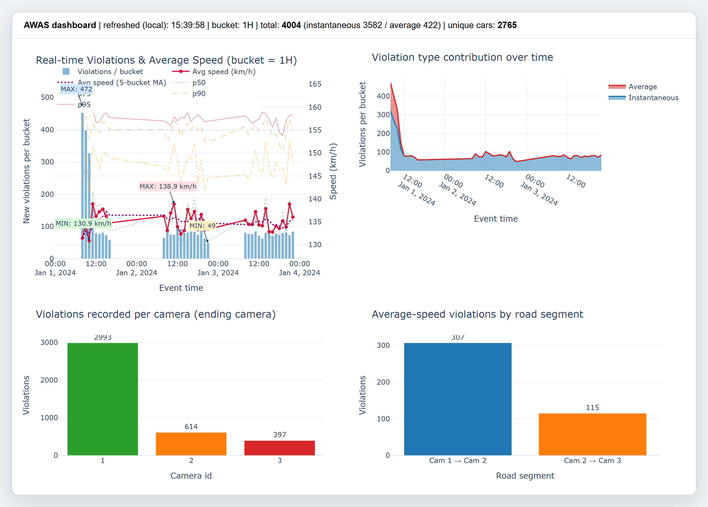

# AWAS 区間速度取締りシステム — Kafka・Spark Structured Streaming・MongoDB

[English](README.md) | 日本語

マレーシアの AWAS(Automated Awareness Safety System)を模した、リアルタイム速度違反検知
パイプラインです。路側の 3 台のカメラが車両の通過情報を Kafka に流し込み、Spark Structured
Streaming が複数ストリームを結合して、カメラ地点での瞬間的な速度超過と、カメラ間の平均速度
違反の両方を検出します。違反は車両ごと・日ごとにまとめて MongoDB に集約され、Plotly / Folium
のダッシュボードが数秒ごとに MongoDB を再取得して表示します。

Haruto Iriyama が 2 人チームの大学プロジェクトとして制作しました。



<sub>実行完了時のダッシュボード。2,765 台の車両に対して違反は合計 4,004 件、
うち瞬間速度違反が 3,582 件、平均速度違反が 422 件です。</sub>

## アーキテクチャ

```
camera_event_A.csv ─▶ producer_a.ipynb ─▶ Kafka topic camera-events-A ─┐
camera_event_B.csv ─▶ producer_b.ipynb ─▶ Kafka topic camera-events-B ─┤
camera_event_C.csv ─▶ producer_c.ipynb ─▶ Kafka topic camera-events-C ─┘
                                                                        │
                       data_design_streaming.ipynb (PySpark)            ▼
     ┌──────────────────────────────────────────────────────────────────────┐
     │  イベント時刻のウォーターマーク(3 分)                              │
     │  car_plate をキーに 120 秒窓で A↔B、B↔C のストリーム間結合        │
     │  カメラの制限速度 / 区間距離とのストリーム–静的結合                  │
     │  瞬間速度違反 + 平均速度違反の検出                                   │
     │  foreachBatch → MongoDB への一括 upsert((car_plate, date) ごとに 1 件)│
     └──────────────────────────────────────────────────────────────────────┘
                                                                        │
                       visualisation.ipynb ◀── MongoDB (violations) ◀───┘
                       Plotly の時系列 + Folium のカメラ地図、5 秒ごとに更新
```

| ノートブック | 役割 |
|---|---|
| `src/producer_a.ipynb`, `producer_b.ipynb`, `producer_c.ipynb` | 1 台のカメラの CSV を *n* 秒ごとに 1 バッチずつ Kafka トピックへ再生 |
| `src/data_design_streaming.ipynb` | MongoDB のデータモデル、コレクション、インデックス(§1–4)。Spark ストリーミング、結合、違反判定ルール、Mongo シンク(§5–11) |
| `src/visualisation.ipynb` | MongoDB をポーリングするライブダッシュボード |
| `data/` | 入力 CSV — [`data/README.md`](data/README.md) を参照(リポジトリには含めていません) |

## 設計上の判断

- **batch_id による結合ではなく、オンラインのストリーム間結合を採用。** A↔B と B↔C を
  `car_plate` をキーに、3 分のウォーターマークのもとで 120 秒のイベント時刻窓で結合します。
  これにより Spark が保持する状態は有界に保たれつつ、1 km 離れたカメラ間を 30 km/h 以上で
  走行するすべての車両が確実にマッチします。
- **区間距離は決め打ちせず計算する。** `camera.csv` のカメラ緯度経度からハーサイン公式で
  求めます。
- **MongoDB のドキュメントは車両ごと・日ごとに 1 件。** `violations[]` 配列を埋め込み、
  冪等な `UpdateOne(upsert=True, $push)` の一括操作と 3 回までの指数バックオフ再試行で
  書き込みます。そのため部分的に適用されたバッチを安全に再試行できます。24 か月の保持期間は
  TTL インデックスで強制します。
- **車両の所有者変更**は、`vehicle.csv` に同じナンバープレートの行を重複して残し、参照時に
  最新の登録行を優先することで扱います。

---

## 1. 前提環境

| コンポーネント | 開発時のバージョン | 備考 |
|---|---|---|
| Python | 3.10 以上 | Jupyter 7 または JupyterLab 4 |
| Apache Kafka | 3.5 以上 | ブローカーに `${AWAS_HOST}:9092` で到達できること |
| MongoDB | 6.0 以上 | サーバーに `${AWAS_HOST}:27017` で到達できること |
| Apache Spark | 3.3 以上 | ノートブックから PySpark を操作。Kafka コネクタの JAR は `pyspark.__version__` に自動で合わせます |

### Python の依存パッケージ

```bash
pip install pyspark kafka-python pymongo pandas numpy plotly folium ipywidgets
```

ほとんどの環境では `kafka-python` で問題ありません。もし壊れた旧 `kafka` PyPI パッケージ
(`simple.py` に `self.async` が含まれ、Python 3.7 以降でパースエラーになるもの)が入っている
環境の場合、各プロデューサーのノートブックは自動的に `kafka3`(メンテナンスされているフォーク)へ
フォールバックします。事前にインストールするには:

```bash
pip install kafka3
```

開発時に使用した詳細なバージョン(これらより新しければ動作するはずです):

```text
pyspark>=3.3.0
kafka-python==2.0.2          # または代替として kafka3
pymongo==4.6.1
pandas==2.2.2
numpy==1.26.4
plotly==5.21.0
folium==0.16.0
ipywidgets==8.1.2
```

ノートブックが利用する Kafka トピック(初回パブリッシュ時にプロデューサーが自動作成しますが、
事前に作成しておくこともできます):

```text
camera-events-A
camera-events-B
camera-events-C
```

---


## 2. 設定 — `HOST_IP` 変数の指定

各ノートブックは IP アドレスで特定のマシンを指しており、この値は OS の環境変数ではなく
**コード内で直接**設定します。

> ⚠️ **重要:** 以下に示す IP はあくまで例です。**必ずご自身のマシンの IPv4 アドレス**に
> 置き換えてください。そうしないと Kafka、MongoDB、Spark が誤ったホストへ接続しようとして
> 失敗します。

### IPv4 アドレスの確認方法

お使いの OS に応じて次のコマンドを実行してください。

- **Windows:** `ipconfig` → *IPv4 アドレス* の項目(例: `192.168.x.x`)
- **macOS / Linux:** `ifconfig` または `ip a` → 有効なネットワークインターフェースの `inet` アドレス

### 設定手順

Jupyter Lab でセルを実行する前に、**5 つのノートブックすべて**を開き、`HOST_IP` 変数を
ご自身の IPv4 アドレスに設定してください。

```python
HOST_IP = '192.168.100.19'   # <-- これは例です。ご自身の IPv4 アドレスに置き換えてください
```

各ノートブックでハードコードされた単一の変数を使うことで、Kafka プロデューサー、MongoDB への
接続、Spark Structured Streaming のシンクがすべて正しいマシンを指すようにしています
(OS の環境変数に依存しません)。


## 3. 実行手順

> 順番が重要です。プロデューサーより先にストリーミング側を起動してください。そうすることで
> Spark の結合状態が空の状態から始まり、新しいイベントだけを処理できます。

1. インフラを起動します — Kafka と MongoDB のコンテナを立ち上げます(両方を公開する
   docker-compose 構成であれば何でも構いません)。
   - Kafka ブローカーに `${AWAS_HOST}:9092` で到達できること。
   - MongoDB に `mongodb://${AWAS_HOST}:27017` で到達できること。
2. `src/data_design_streaming.ipynb` を開き、上から順にすべてのセルを実行します。
   - §1–§4 で Mongo のデータモデルを定義し、コレクションとインデックスを作成します。
   - §5–§11 で Spark Structured Streaming、A/B/C の結合、違反検出、Mongo シンクを開始します。
   - プロデューサーがパブリッシュしている間、ストリーミングクエリは実行したままにします。
3. 新しいカーネルを 3 つ開き、各プロデューサーのノートブックを並行して実行します:
   - `src/producer_a.ipynb`
   - `src/producer_b.ipynb`
   - `src/producer_c.ipynb`
   - それぞれ `n` 秒ごとに 1 バッチをパブリッシュします。既定の `MAX_BATCHES = 300` により
     デモは 10 分以内に収まります。`None` にすると 15 時間分をフル再生します。
4. ストリーミングパイプラインを動かしたまま `src/visualisation.ipynb` を開きます。§0 の
   健全性チェックのセルが、Mongo にまだデータが届いていない場合の原因を具体的に教えてくれます。
   ダッシュボードは 5 秒ごとに更新されます。

きれいに停止するには、まずプロデューサーのノートブックを中断し、次にストリーミングの
ノートブックで `query.stop()`(§12)を実行してから、インフラを停止してください。

---


## 4. 主要パラメータ(`data_design_streaming.ipynb` の §1.2 にも記載)

| パラメータ | 値 | 理由 |
|---|---|---|
| プロデューサーのパブリッシュ間隔 `n` | 1 秒 | デモ実行を約 5 分に収めるため(300 バッチ × 1 秒 = 300 秒)。A/B/C で同じ `n` を使用。 |
| `MAX_BATCHES`(プロデューサーごと) | 300 | 約 5 分のデモ。プロデューサー A は約 6,000 イベントをパブリッシュします。B と C は CSV のバッチあたり件数が少ないため、より少なくなります。`None` でファイル全体(`n = 1 秒` で約 7.7 時間)。 |
| `DEMO_EVENT_MINUTES`(プロデューサーごと) | 30 | CSV 読み込み時に適用するイベント時刻の上限。3 つのプロデューサーがカメラ時刻の最初の 30 分だけを送出するため、A/B/C が同じ時間帯に重なり、ストリーム間結合が密にマッチします。`None` で上限なし(ファイル全体)。 |
| 各ストリームのウォーターマーク | 3 分 | Spark の状態を有界に保ちつつ、観測された B↔C の到着ずれの最大値を吸収します |
| A↔B および B↔C の結合窓 | 120 秒 | 1 km 離れたカメラ間を 30 km/h 以上で走行する全車両をカバー(観測された最低速度は約 60 km/h) |
| トリガー間隔 | 5 秒 | foreachBatch の周期。「ライブ」に見える程度に短く、Mongo への書き込みコストを償却できる程度に長い値 |
| 日次マージのキー | `(car_plate, date)` | 車両ごと・日ごとに 1 件の Mongo ドキュメント。`violations[]` 配列を埋め込みます |
| Mongo への書き込み | `UpdateOne(upsert=True, $push)` による `bulk_write` | 冪等かつ効率的なシンク |
| 保持期間 | 24 か月 | 派生フィールド `expires_at = date + 730 日` に対する TTL |
| 可視化の更新 | 5 秒ごと、最大 360 回(約 30 分) | 延長するには §4 のセルを再実行します |

---


## 5. 違反判定のルール

- 瞬間速度: 記録したカメラ地点で `speed_reading > camera.speed_limit` ならそのイベントを違反と
  判定します。1 台の車がカメラ 1・2・3 のそれぞれで独立に検出されることがあります。
- 平均速度(区間): 結合窓の内側で同一の `car_plate` がイベント時刻順に観測されたペア
  (A→B および B→C)ごとに
  `avg_speed = distance(cam_start, cam_end) / (t_end − t_start)` を計算します。
  `avg_speed > speed_limit(cam_end)`(終点側カメラの制限速度)であれば違反とします。
- カメラ間の距離は `camera.csv` の緯度経度からハーサイン公式で計算します(1 km と決め打ちは
  していません)。
- 同一の `(car_plate, date)` に属する違反は、1 件の Mongo ドキュメントの `violations[]` 配列に
  まとめられます。

---


## 6. トラブルシューティング

| 症状 | 考えられる原因 | 対処 |
|---|---|---|
| プロデューサー / ストリーミング / 可視化が Kafka または Mongo への `ConnectionRefusedError` を出す | `AWAS_HOST` が誤っている | `export AWAS_HOST=<正しいホスト IP>` を設定し、Jupyter カーネルを再起動する |
| プロデューサーが `from kafka import KafkaProducer` で `SyntaxError: self.async` を出す | 壊れた旧 `kafka` PyPI パッケージが入っている | プロデューサーは自動的に `kafka3` へフォールバックします。`pip install kafka3` でインストールしてください |
| ストリーミングのノートブックが Kafka の読み取りで止まり、イベントが来ない | Spark の Kafka コネクタのバージョン不一致 | JAR の座標は `pyspark.__version__` に自動で合わせています。Spark 自体が 3.3 より古いとコネクタが存在しない可能性があるため、PySpark を更新してください |
| プロデューサーを起動したのに、可視化が `No violations in MongoDB yet` と表示する | Spark が動いていないか、Kafka に到達できていない | §0 の健全性チェックのセルを実行してください。確認すべき 4 点が順番に表示されます |
| ヘッダーは表示されるが、`clear_output` による更新後にプロットが出ない | `clear_output` 後に Plotly の JS マウントが再接続されていない | 修正済みです。セル 1 で `pio.renderers.default = 'notebook_connected'` を設定しています |
| ストリーミングのログに `[batch=N] no violations in this microbatch` が繰り返し出る | 正常なアイドル状態。プロデューサーが新しいデータを出していないか、ストリーム間結合がバッファリング中です | プロデューサーのノートブックが "published batch_id=..." を出力し続けているか確認してください |
| `BulkWriteError` が 1 回出たあと成功する | Mongo の再試行パスが発動した | 想定内です。シンクは冪等な操作で 3 回までの指数バックオフ再試行を行うため、部分的に成功した状態からの再試行も安全です |

---


## 7. 前提

- 車両 CSV のヘッダー `vechicle_type` は元データのタイプミスですが、そのまま保持し、取り込み後に
  `vehicle_type` へ改名しています。
- プロデューサー A → camera_id 1、B → camera_id 2、C → camera_id 3(`camera.csv` と、イベント
  CSV の実データに整合)。
- プロデューサー間で同じ `batch_id` がイベント時刻上で揃っている必要はありません。`batch_id` では
  結合せず、イベント時刻とウォーターマークに基づく真のオンラインのストリーム間結合を行います。
- `vehicle.csv` 内の重複する `car_plate` の行はそのまま残し、参照時には最後に登録された行を
  優先することで所有者の変更を表現します。
- ここでいう「オンライン結合」とはストリーム間の(無限の)結合であり、ストリーム–静的結合では
  ありません。
- 日次集約のキーは違反の開始タイムスタンプの暦日(タイムゾーンなしの UTC、元 CSV の
  タイムスタンプ形式に一致)です。
- 区間距離は `camera.csv` の緯度経度からハーサイン公式で計算します。100 km 未満の距離では
  数メートルの精度があり、決め打ちはしていません。
